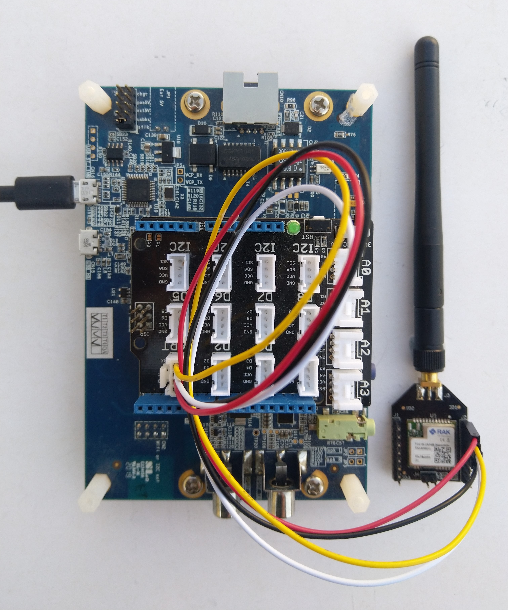
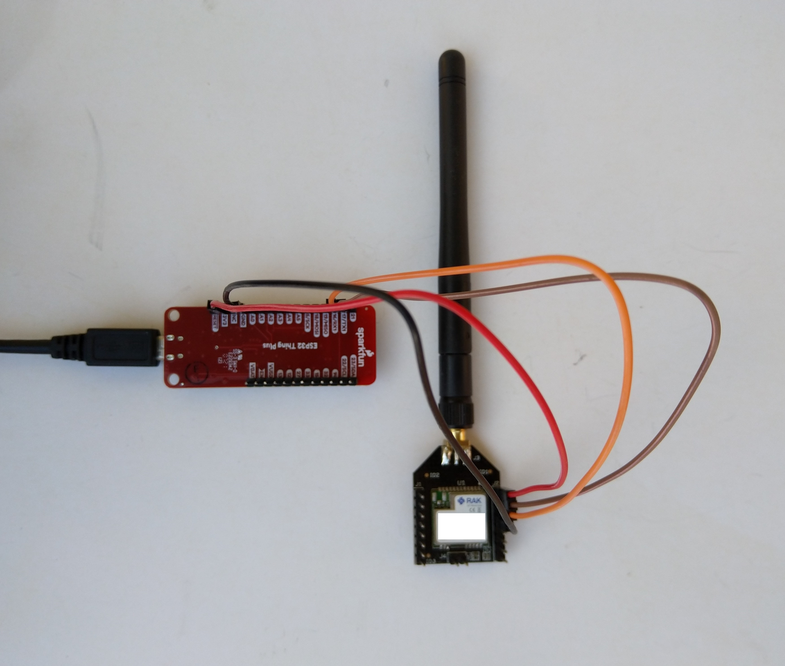

# RAK4200LoRaWAN-NetNF
A C# library for [LoRaWAN](https://lora-alliance.org/about-lorawan) connectivity for [RAKwireless](https://www.rakwireless.com/en-us) [RAK4200 Module](https://store.rakwireless.com/products/rak4200-lora-module) equipped [.NET nanoFramework](https://www.nanoframework.net/) powered devices.

This repo has the source code for the series of blog posts written as I work on the library

01. [Basic connectivity](http://blog.devmobile.co.nz/2022/05/06/net-nanoframework-rak4200-lorawan-library-basic-connectivity/)
02. [OTAA Join](http://blog.devmobile.co.nz/2022/05/12/net-nanoframework-rak4200-lorawan-library-otaa-join/)
03. [ABP Join](http://blog.devmobile.co.nz/2022/05/21/net-nanoframework-rak4200-lorawan-library-abp-join/)
04. [Factory Reset](http://blog.devmobile.co.nz/2022/05/25/net-nanoframework-rak4200-factory-reset/)
05. [Library Usage](http://blog.devmobile.co.nz/2022/06/06/net-nanoframework-rak4200-library-usage/)

I used a local [RAK7258 WisGate Edge Lite](https://store.rakwireless.com/collections/wisgate-edge/products/rak7258-micro-gateway) connected to [The Things Network](https://www.thethingsnetwork.org/) to test my implementation.
